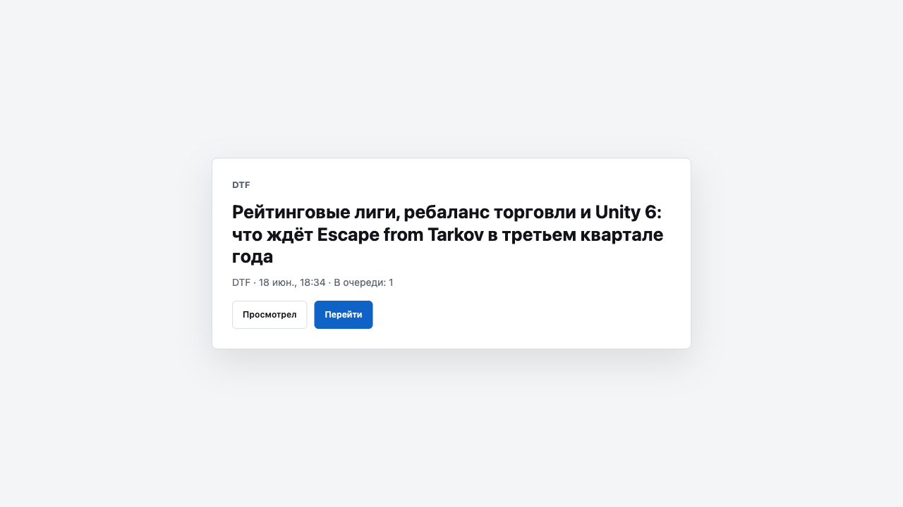

# DTF New Tab Queue

A small Manifest V3 extension for Chromium-based browsers that turns the new tab page into a manual queue of DTF news.



## Features

- Shows exactly one DTF headline at a time.
- Keeps the current card until you explicitly process it.
- **Просмотрел** advances without leaving the new tab page.
- **Перейти** opens the DTF article in a new tab and advances the queue.
- Catches up on newer headlines automatically when the local backlog empties.
- Lets you step explicitly into older news with **Глубже в архив**, one batch at a time.
- Persists queue state locally across browser restarts.
- Supports retry, reset, bounded pagination, and duplicate filtering.
- Performs no background polling and has no analytics.

## Install

1. Clone or download this repository.
2. Open `chrome://extensions` in Chrome or another Chromium-based browser.
3. Enable **Developer mode**.
4. Click **Load unpacked**.
5. Select the repository directory.
6. Open a new tab.

The first launch requests the latest batch from DTF and uses its first item as the start of the queue.

## How It Works

The extension reads `https://api.dtf.ru/v2.10/news` directly from the new tab page. The first response becomes a local snapshot:

- the first item is `current`;
- the remaining items are `backlog`;
- the API cursor is stored as `lastId`.

No request is made while an existing card is simply displayed. A new request happens only after an explicit action needs another page, or when you press **Проверить ещё раз** or **Сбросить**.

When the backlog empties, the extension fetches the **first** page again and shows
only headlines you have not seen yet — it does not crawl backward by default, so the
queue can reach a real end. From the end screen you can press **Проверить новые** to
re-check the top, or **Глубже в архив** to load one older page at a time. Forward
checks never move the archive cursor, so stepping into the archive resumes from where
you left off.

## Permissions And Privacy

The manifest requests only:

- `storage` to persist the queue locally;
- host access to `https://api.dtf.ru/*` to read the news feed.

API requests include DTF credentials so the extension can use the browser's signed-in DTF session. Queue data never leaves `chrome.storage.local`. See [Privacy](docs/privacy.md) for details.
Requests are sent with `credentials: "include"`, so they carry your existing DTF
session cookies to `api.dtf.ru`; the extension never reads or copies those cookies.

## Development

Requirements: Node.js 20 or newer.

```bash
npm test
npm run check
```

The test suite covers API normalization, cursor pagination, duplicate handling, persistence validation, retry/reset behavior, cross-tab serialization, URL safety, and manifest privileges.

## Project Structure

```text
manifest.json       Extension manifest
src/dtfApi.js       DTF API client and response normalization
src/dtfUrl.js       Allowed DTF URL validation
src/queueStore.js   Persistent state and bounded event log
src/queueService.js Queue state machine and pagination
src/newtab.*        New tab interface
test/               Node.js unit tests
```

More detail is available in [Architecture](docs/architecture.md).

## Documentation

- [Changelog](CHANGELOG.md)
- [Architecture](docs/architecture.md)
- [Privacy](docs/privacy.md)
- [Contributing](CONTRIBUTING.md)
- [Security Policy](SECURITY.md)
- [License](LICENSE) (MIT)

## Compatibility

The extension targets Chromium browsers with Manifest V3, Promise-based extension APIs, and the Web Locks API. It depends on DTF's current `v2.10/news` response shape, which is not controlled by this project.
